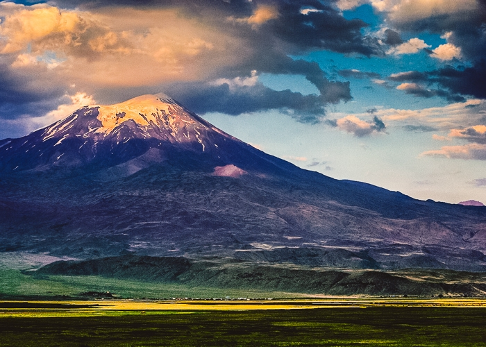

> I have seen more than I remember, and remember more than I have seen
> Benjamin Disraeli
>
> we are thickened time
> Marisa Maderi

##### I

To be so frantic and swing oneself to tell about all types of travel, about all the books that
touched the subject, all the categories of adventurers, daredevils, wanderers, lunatics. Is it even
possible? Is it possible to write anything about the journey in the face of so many texts that
history of the genre serves. How to bring them closer, shorten distance to our time, how refer to
them or put one's own experience against this thick background? In silos of literary excess, how to
not manifold same patterns, not repeat oneself? That is the, somewhat long-winded, question.
Question that seems to be without a good answer. This whole writing business, in any case, when one
looks at it from a distance, looks quite miserable and perhaps there is no better way out than to
rip the matter directly, to bite *ab initio* into the very meat of affairs; into what the journey is
feeding of and what it *is* as such. I say *is*, although more adequate question would probably be:
"what can it be?"*. In the end, as the old saying goes, everyone has their own definition of
everything, and if so, certain narrowing ought to be made. It has long been known that there is no
such thing as objective cognition, writing about the trials and tribulations of travel must be of
necessity then, a story in the mantle of subjectivity. An account of a very personal take, with all
the traps that come with it. Ultimately, is this not the only available method today that would not
paralyze the whole shebang from the get-go? The only one that allows to — at least to some minimal
degree — add anything meaningful to what we (still) proudly call the world.

##### II

To talk about the journey then in such manner so to avoid being sucked up by the abyss of the Book.
The Book that is being written ever since the man ventured forth into the unknown — from the
archetypal journey of Ulysses to Goethe's pilgrimage. Whole thing does not end on the great Goethe
of course (though he used to be called the last of true travelers). We still have such mighty
wizards as Muratow, Leigh Fermor, wild Chatwin or agelessly hipnotic Sándor Márai. This list, when
we look closer, seems to have no end, and the only thing one can be sure of is that it will give
birth to other names.

##### III

So to read from the Book and at the same time to write in it what is ours. Browse it through, but
with the awareness of its immensity. Park ourselves in its refreshing oases, but at the same time
try to report what has touched us[^1], give an account of our ride. *Our*, because, after all,
without an individual experience, without a personal dimension, the journey — even best prepared —
can only be a duplication of guide maps. A rewrite of extraneous voices and book sections, and
therefore precisely as such — not *ours*. After all, on this path, it is important to *"when
following in the footsteps trust our own eye"*. Yes, *"maybe it's true [...] that everything has
already taken place"*. But the problem is that *"I was not there"*. The simple fact that *"now,
here, in this time, i am in this place — this changes everything. And radically. For me, it is"*.
Otherwise, this whole wandering of ours is, at best, a guise, a simulacrum[^2]. A chase on well beaten
paths, after *"monuments, scenic spots, after all that misery of baedeker'y trinkets"*[^3]. Here i
happily chime with Dariusz Czaja.

##### IV

But where in all this comes the need of writing? (or of photography in that matter). Why not stop at
the experience of travel itself? Perhaps it is a matter of faith. Faith in that old wisdom saying
that to write is to travel for the third time[^4]. Yes, for the third time. After all — apart from
the "proper" voyage — who of us doesn't know that phase of feverish waiting, even before setting
off? All those countless hours devoted to gathering information, images; to the weaving of plans:
with our finger on the map and our eye to the future. All that voyeurism and peeking ahead — who of
us hasn't done it. Who doesn't remember that dreamy salivation of wondering "how it will be there".
In that sense this is indeed our first trip to the place. But if so, it is only logical that this
process would have its own obverse. A kind of twin brother, namely: the remembrance of a journey.
Some say it's that third journey that counts most. That it's the most relevant one. We all know
this strange pangs and pulls, that choke in the hole, when after some time from our return, we begin
to feel that special kind of longing, that inevitably teleports our thoughts to the time when
journey took place. That longing that makes us start it all over. That makes us, once again, put in
motion those heavy cogs of remembrance. Often, this journey turns out to be no less wonderful of
adventure. And not just only the adventure of memory. Very often on the road we are just too close
to things; to everything. Too close to sufficiently understand what we truly experiencing. Simone
Weil wrote that *"distance is the soul of beauty"*. Perhaps an *ex post* apprehension of one's own
life experience during travel is, in a similar way, a function of distance.

##### V

So remembering and at the same time keeping a record of it. Oftentimes these are unwitting records,
some feckless passes, impossible attempts; a desire to reproduce what once was. We blacken the paper
in hope of at least a poor ersatz of return. We want, once again, to live in closeness of our own
memory. Grappling with it we stand, eye to eye, with our past selves. Looking for *other breath*,
some previous, lighter version of us, we dig into remnants of past sparkle. A lucidness that every
day we find harder and harder within ourselves. And every now and then it happens: suddenly,
standing in the crossing point of the world-life-time, roving in the dark, something goes well.
There, in one fell swoop, we take off from remembered past that Levinas' face — *our* face — and
we try it on. Does it match who we are now?

---

This text, raw and transcribed from my notebook jottings, is available
also ( in a more refined form) as part of my ongoing travel essays that appear in polish print, in a
segment of <a href="http://alpha.bn.org.pl/record=b1300628*en" title="Waga i Miecz">Waga i Miecz</a>
magazine.

[^1]: See D. Czaja, "Gdzieś dalej, gdzie indziej", trans. auth., Wydawnictwo Czarne, 2010, p. 12.

[^2]: See J. Baudrillard, "Simulacra and Simulation", University of Michigan Press, 1994

[^3]: D. Czaja, dz. cyt., s. 13.

[^4]: Vittorio Possenti in his book talks about "third voyage", coining the term after Plato. See V. Possenti, “Nihilism and Metaphysics: The Third Voyage”, State University of New York Press, 2014

